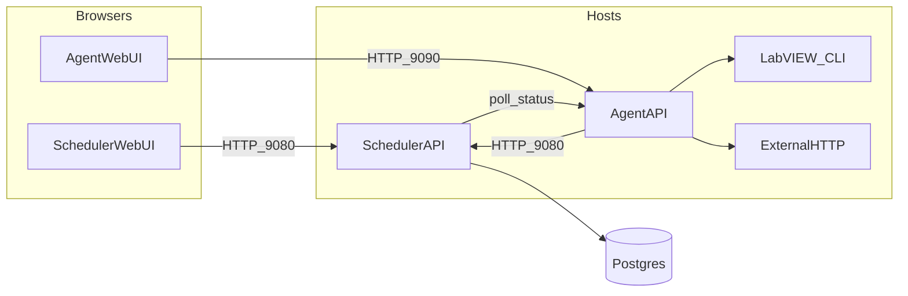
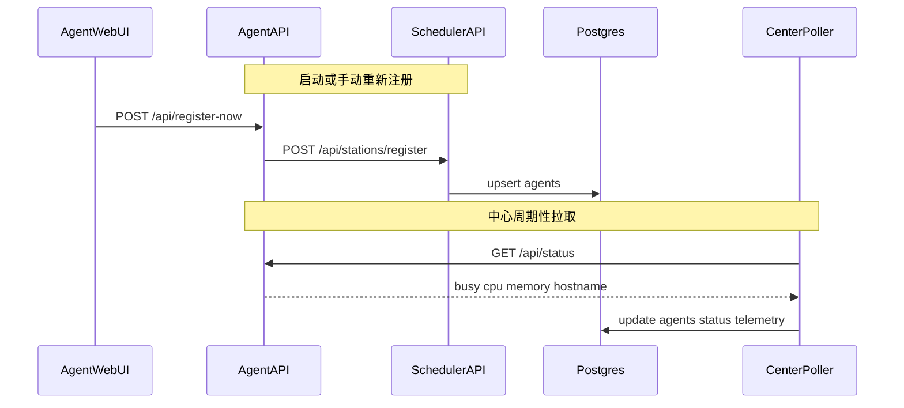
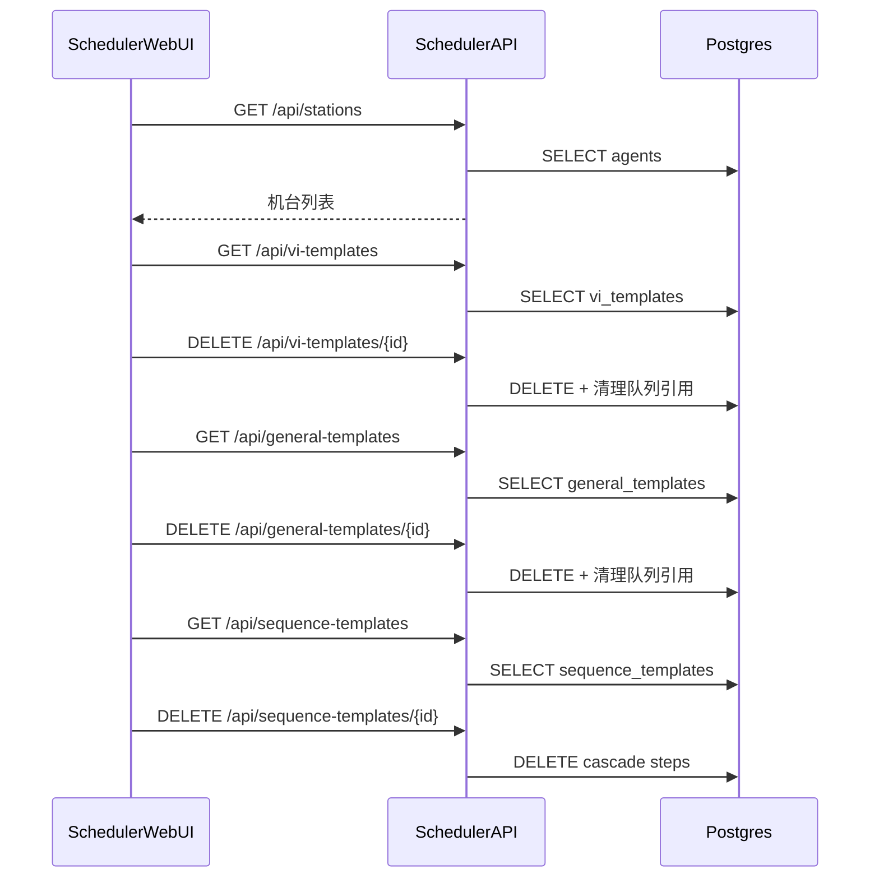
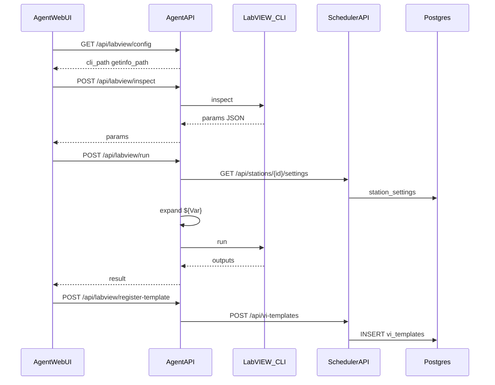
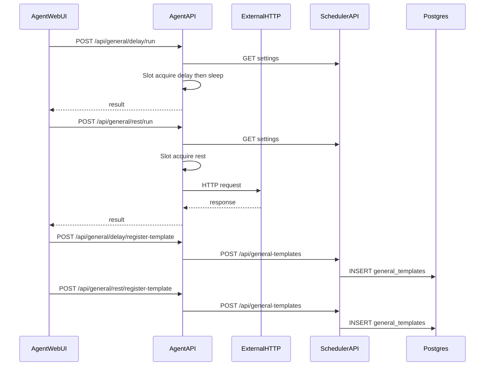
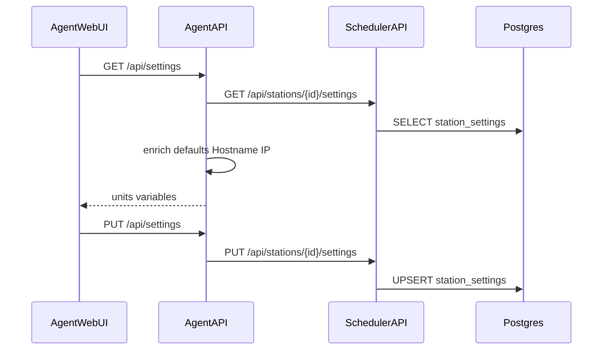
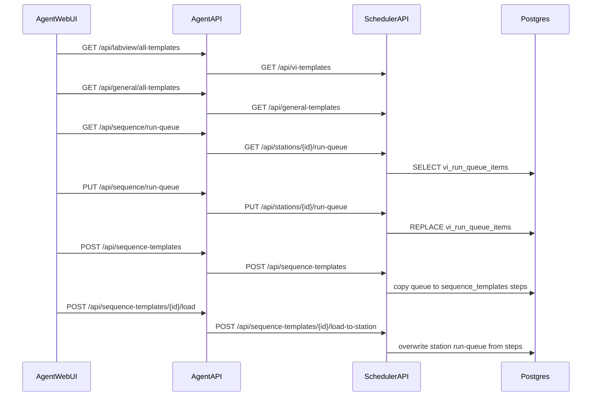
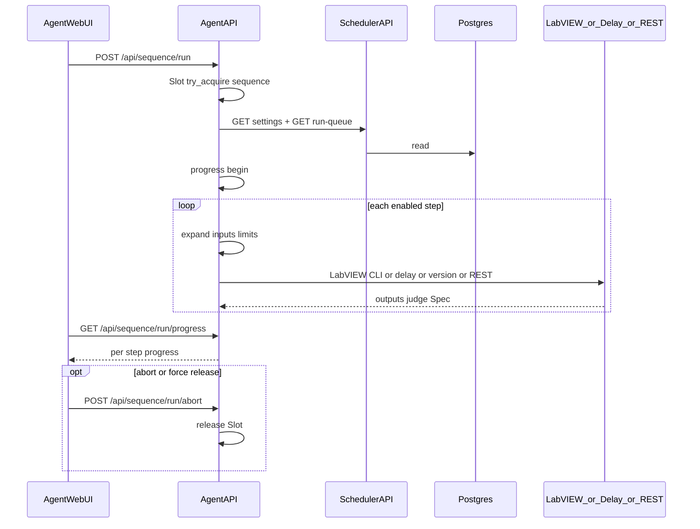

# ATLAS API 与调用关系

**无鉴权。** 仅限可信内网。路由以各服务 `src/api.rs` 的 `router()` 为准。

| 服务 | 默认基址 | 代码 |
|------|----------|------|
| **atlas-center** | `http://127.0.0.1:9080` | `src/api.rs` |
| **atlas-station** | `http://127.0.0.1:9090` | atlas-station `src/api.rs` |
| **数据库** | Postgres（仅中心连接） | `src` → `Store` |

两套 HTTP API **独立**（通常不同主机）。浏览器 **只打本机对应 WebUI 后端**：中心页 → 中心 API；Agent 页 → Agent API。Agent **从不**直连数据库；持久化一律经中心 API 落库。

### 使用方图例

| 标记 | 含义 |
|------|------|
| **中心 WebUI** | `static` 直接调用中心 `/api/*` |
| **Agent WebUI** | atlas-station `static` 直接调用 Agent `/api/*` |
| **Agent 进程** | Agent 服务端代调中心（注册、写模板、队列、设置等） |
| **中心 Poller** | 中心后台周期拉取各 Agent `GET /api/status` |
| **未使用** | 两端 WebUI 均未调用（可能仍被 Agent 进程使用，见备注） |

通用约定：JSON 为主；`/api/health` 返回纯文本 `ok`；错误体常见 `{ "error": "..." }`。

---

# 第〇部分：调用关系总览

## 0.1 五层角色



要点：

- **只有 Scheduler API 读写 Postgres。**
- **中心 WebUI 不访问 Agent**；机台状态靠中心 Poller 拉 Agent `/api/status` 写回 `stations` 表。
- **Agent WebUI 不访问中心、不访问 DB**；需要持久化时由 Agent API 转发到中心。

## 0.2 谁调用谁（矩阵）

| 调用方 → | 中心 API | Agent API | Postgres | LabVIEW CLI / 本机 Delay / 外网 REST |
|----------|----------|-----------|----------|--------------------------------------|
| 中心 WebUI | 是 | 否 | （经中心 API） | 否 |
| Agent WebUI | 否 | 是 | 否 | （经 Agent API） |
| Agent 进程 | 是 | — | 否 | 是（执行类） |
| 中心 Poller | — | `GET /api/status` | 写 `stations` | 否 |

## 0.3 主要数据表（中心）

| 表 | 用途 |
|----|------|
| `stations` | 机台注册与 Poller 刷新的状态/资源 |
| `vi_templates` | LabVIEW VI 模板（`origin_agent_id` 可空，删机台时保留模板） |
| `general_templates` | Delay / Version / REST 等通用模板（同上） |
| `vi_run_queue_items` | 每台机当前序列执行队列 |
| `sequence_templates` / `sequence_template_steps` | 已保存的序列模板（`created_by_agent_id` 可空，删机台时保留模板；删功能模板时去掉对应步骤） |
| `station_settings` | 每台机手工 variables 与 array_expand_mode |
| `center_units` | 全局共享单位表（中心 WebUI 维护，所有机台 Spec 复用） |
| `station_device_profiles` | 每台机设备配置档（`setting_json`，至多一条 `is_active`） |
| `station_calibration_profiles` | 每台机校验配置档（同上，独立表） |
| `station_channels` | 每台机通道定义（`channel_index` / `name` / `enabled` / `overlay_json`） |
| `station_config_templates` | 机台配置快照模板（可套用到其它机台；创建者可空） |
| `spec_templates` | 产品 Spec INI 解析后的模板库（`spec_json` + 元数据） |
| `test_runs` | 每通道一次终态（overall / 耗时 / 模板快照） |
| `test_run_context` | 1:1 SN / 工单 / hostname；PN、温度角第一期空串 |
| `test_run_steps` | 逐步实测、限值、Pass/Fail |

---

## 0.4 机台注册与状态刷新



中心 WebUI 只读：`GET /api/stations`（约 2s 刷新机台页）← 读库中 Poller 已写入的快照。

---

## 0.5 中心 WebUI：机台 / 已注册功能 / 序列模板

中心浏览器 **只调中心 API**，全部落库，不经 Agent。



中心 WebUI **不**调用：settings、run-queue、模板 POST/PATCH、序列 create/load。

---

## 0.6 Agent：LabVIEW 试跑与注册



列表（VI 页 / 序列左侧）：`GET /api/labview/all-templates` → 中心 `GET /api/vi-templates`。

---

## 0.7 Agent：Delay / REST 试跑与注册



---

## 0.8 Agent：本机设置（units / variables）



`${Name}` 展开在 **试跑 / 序列执行** 时再次读 settings，不经过设置页。

---

## 0.9 序列：编辑队列与保存/加载模板



说明：`load-to-station` 只改 **中心库里该机的队列**；机台再 `GET run-queue` 刷新 UI，**没有**中心→机台的推送。

---

## 0.10 序列：执行 / 进度

执行在 **Agent 本机**；队列快照来自中心 DB；busy 槽在 Agent 内存。序列一次性跑完，不再支持断点暂停 / continue。



完成后 Agent 写本机序列运行日志；通道终态另 POST 中心 `/api/test-runs` 落库（best-effort，失败不影响 HTTP 结果）。

---

## 0.11 功能 → 调用链速查

| 功能 | 链路 |
|------|------|
| 中心看机台 | 中心 WebUI → 中心 `GET /api/stations` → DB；状态由 Poller ← Agent `/api/status` |
| 中心删 VI/通用/序列模板 | 中心 WebUI → 中心 `DELETE ...` → DB |
| VI 试跑 | Agent WebUI → Agent `labview/run` →（读 settings）→ LabVIEW CLI |
| VI 注册 | Agent WebUI → Agent `register-template` → 中心 `POST /api/vi-templates` → DB |
| Delay/Version/REST 试跑 | Agent WebUI → Agent `general/*/run` → Slot → 本机/外网 |
| Delay/Version/REST 注册 | Agent WebUI → Agent `register-template` → 中心 `POST /api/general-templates` → DB |
| 设置读写 | 中心 WebUI `#/configs` → `GET/PUT /api/stations/{id}/settings` → DB；Agent 进程 GET 展开变量 |
| 序列队列编辑 | Agent WebUI → Agent `/api/sequence/run-queue` → 中心 `/api/stations/{id}/run-queue` → DB |
| 序列存模板 | Agent WebUI → Agent `POST /api/sequence-templates` → 中心同名 → DB（自队列快照） |
| 序列加载模板 | Agent WebUI → Agent `.../load` → 中心 `.../load-to-station` → DB 覆盖队列 |
| 序列执行 | Agent WebUI → Agent `/api/sequence/run*` → 读中心队列+设置 → 本机逐步执行 |
| 中心 Spec 模板库 | 中心 WebUI `#/specs` → `GET/POST/PUT/DELETE /api/spec-templates` → DB |
| 步骤绑定 Spec 模板 | Agent WebUI 步骤详情 → `PUT run-queue` 写入 `spec_template_id` / `spec_section` / `spec_metrics`；执行时 Agent 解析模板 section 并与手填 `limits` 合并（同名 `output` 手填优先） |
| 通道终态回写 | Agent 进程 → 中心 `POST /api/test-runs` → DB（`test_runs` + `test_run_context` + `test_run_steps`） |
| 中心查运行 | 中心 WebUI `#/runs` → `GET /api/test-runs` / `GET /api/test-runs/{id}` → DB |

---

# 第一部分：调度中心 API

**基址：** `http://127.0.0.1:9080`  
**可调用的 WebUI：** 仅 **中心 WebUI**。Agent 浏览器不直接打中心。

## 1.1 接口一览与使用方

| 方法 | 路径 | 使用方 | 备注 |
|------|------|--------|------|
| GET | `/api/health` | **未使用** | |
| POST | `/api/stations/register` | **Agent 进程** | 注册/upsert |
| GET | `/api/stations` | **中心 WebUI** · **Agent 进程** | 列表；Agent 用于 resolve `agent_id` |
| GET | `/api/stations/{id}` | **未使用** | |
| GET | `/api/vi-templates` | **中心 WebUI** · **Agent 进程** | 中心列表；Agent `all-templates` |
| POST | `/api/vi-templates` | **Agent 进程** | VI 注册写入 |
| GET | `/api/vi-templates/{id}` | **未使用** | |
| PATCH | `/api/vi-templates/{id}` | **Agent 进程** | Agent `PATCH /api/labview/templates/{id}` |
| DELETE | `/api/vi-templates/{id}` | **中心 WebUI** | 已注册功能 · 删除 |
| GET | `/api/general-templates` | **中心 WebUI** · **Agent 进程** | |
| POST | `/api/general-templates` | **Agent 进程** | Delay/Version/REST 注册 |
| GET | `/api/general-templates/{id}` | **未使用** | |
| DELETE | `/api/general-templates/{id}` | **中心 WebUI** | |
| GET | `/api/sequence-templates` | **中心 WebUI** · **Agent 进程** | |
| POST | `/api/sequence-templates` | **Agent 进程** | 自该机 run-queue 快照建模板 |
| GET | `/api/sequence-templates/{id}` | **未使用** | |
| DELETE | `/api/sequence-templates/{id}` | **中心 WebUI** | |
| POST | `/api/sequence-templates/{id}/load-to-station` | **Agent 进程** | 覆盖 DB 中该机队列（非 HTTP 推 Agent） |
| GET | `/api/spec-templates` | **中心 WebUI** · **Agent 进程** | 产品 Spec 模板列表 |
| POST | `/api/spec-templates` | **中心 WebUI** · **Agent 进程** | 导入 INI 或按 `spec`/`name` 新建 |
| GET | `/api/spec-templates/{id}` | **中心 WebUI** · **Agent 进程** | 含 `spec` JSON |
| PUT | `/api/spec-templates/{id}` | **中心 WebUI** | 改名称/PN/备注/`spec` |
| DELETE | `/api/spec-templates/{id}` | **中心 WebUI** · **Agent 进程** | → `204` |
| GET | `/api/stations/{id}/run-queue` | **Agent 进程** | ← Agent `GET /api/sequence/run-queue` |
| PUT | `/api/stations/{id}/run-queue` | **Agent 进程** | ← Agent `PUT /api/sequence/run-queue` |
| GET | `/api/stations/{id}/settings` | **中心 WebUI** · **Agent 进程** | 中心编辑页；Agent GET 展开（附带 profiles；`units` 为全局只读） |
| PUT | `/api/stations/{id}/settings` | **中心 WebUI** | 仅持久化 variables + `array_expand_mode` |
| GET/PUT | `/api/units` | **中心 WebUI** · **Agent 进程** | 全局单位表 |
| GET/POST | `/api/stations/{id}/device-profiles` | **中心 WebUI** · **Agent 进程** | 列表 / 创建设备配置档 |
| PUT/DELETE | `/api/stations/{id}/device-profiles/{profileId}` | **中心 WebUI** | 更新 / 删除 |
| POST | `/api/stations/{id}/device-profiles/{profileId}/activate` | **中心 WebUI** | 设为当前设备档 |
| GET/POST | `/api/stations/{id}/calibration-profiles` | **中心 WebUI** · **Agent 进程** | 校准配置档（同上） |
| PUT/DELETE | `/api/stations/{id}/calibration-profiles/{profileId}` | **中心 WebUI** | |
| POST | `/api/stations/{id}/calibration-profiles/{profileId}/activate` | **中心 WebUI** | |
| GET/PUT | `/api/stations/{id}/channels` | **中心 WebUI** · **Agent 进程** | 中心编辑；PUT 全量替换；Agent GET 展开 |
| POST | `/api/test-runs` | **Agent 进程** | 通道终态落库；201 新建 / 200 同 id 已有 / 400 校验失败 |
| GET | `/api/test-runs` | **中心 WebUI** | 列表；query `agent_id` `overall` `sn` `from` `to` `limit` `offset` |
| GET | `/api/test-runs/{id}` | **中心 WebUI** | 详情；缺失 → 404 |

## 1.2 健康检查

**GET** `/api/health` → 文本 `ok` · 使用方：**未使用**

## 1.3 机台

**POST** `/api/stations/register` · 使用方：**Agent 进程**

```json
{ "name": "LINE-01", "ip": "192.168.1.10", "port": 9090 }
```

**GET** `/api/stations` · 使用方：**中心 WebUI** · **Agent 进程**  
**GET** `/api/stations/{id}` · 使用方：**未使用**

响应字段：`id`, `name`, `ip`, `port`, `status`, `cpu_percent`, `memory_percent`, `busy`, `last_seen_at?`, `created_at`

## 1.4 VI 模板

**GET** `/api/vi-templates` · 使用方：**中心 WebUI** · **Agent 进程**  
Query：`agent_id?` · `kind?`

**POST** `/api/vi-templates` · 使用方：**Agent 进程**

| 字段 | 说明 |
|------|------|
| `agent_id` | 来源机台 ID |
| `name` | 显示名称 |
| `vi_path` · `cli_path` · `getinfo_path` | 绝对路径 |
| `inputs` | 数组（必填） |
| `outputs` | 数组，默认 `[]` |
| `kind` | 默认 `labview` |
| `show_front_panel` | bool |
| `timeout_secs` | 可选 |

**GET** `/api/vi-templates/{id}` · 使用方：**未使用**  
**PATCH** `/api/vi-templates/{id}` · 使用方：**Agent 进程** — `name?` · `inputs?` · `show_front_panel?` · `timeout_secs?`  
**DELETE** `/api/vi-templates/{id}` · 使用方：**中心 WebUI** → `204`

## 1.5 通用模板

**GET** `/api/general-templates` · 使用方：**中心 WebUI** · **Agent 进程**  
Query：`agent_id?` · `kind?`

**POST** `/api/general-templates` · 使用方：**Agent 进程**  
**GET** `/api/general-templates/{id}` · 使用方：**未使用**  
**DELETE** `/api/general-templates/{id}` · 使用方：**中心 WebUI** → `204`

## 1.6 序列模板

**GET** `/api/sequence-templates` · 使用方：**中心 WebUI** · **Agent 进程**  
**POST** `/api/sequence-templates` · 使用方：**Agent 进程** — `{ "agent_id", "name", "note?" }`（服务端用该机当前 run-queue 生成 steps）  
**GET** `/api/sequence-templates/{id}` · 使用方：**未使用**  
**DELETE** `/api/sequence-templates/{id}` · 使用方：**中心 WebUI** → `204`  
**POST** `/api/sequence-templates/{id}/load-to-station` · 使用方：**Agent 进程** — `{ "agent_id" }` → 覆盖 `vi_run_queue_items`

`steps[]`：与执行队列 `items[]` 相同字段（含 `section` 段头：`name` · `collapsed`）。

## 1.6a Spec 模板

产品 Spec INI（`*_Spec.ini`，如 `Tunn_FMT_Spec.ini`）在中心解析后存为 `spec_json`；序列步骤可选引用 **模板 ID + section 名**（如 `FMT_HT`），运行时 Agent 将 section 内 `_UL`/`_LL` 指标转为 `limits` 并与步骤手填 `limits` 合并（**手填覆盖同名字段**）。Section 名支持 `${Var}` 展开；`spec_metrics` 为空表示 section 内全部指标。

典型流程：中心 `#/specs` 新建或导入 INI → 在库中编辑 Section/指标上下限 → Agent 序列步骤选择模板与 section → 保存队列 → 执行时按 VI `output` 键判 Pass/Fail。INI 导入只作兼容入口。

**GET** `/api/spec-templates` · 使用方：**中心 WebUI** · **Agent 进程**

```json
{ "items": [{ "id", "name", "product_pn", "source_filename", "section_count", "created_by_agent_name?", "updated_at" }] }
```

**POST** `/api/spec-templates` · 使用方：**中心 WebUI** · **Agent 进程** → `201`

| 字段 | 说明 |
|------|------|
| `ini_text` | 可选；有则服务端 `parse_spec_ini`；解析失败或无 section → `400` |
| `spec` | 可选；无 `ini_text` 时写入该 JSON（`{ version, sections }`） |
| `name` | 可选；缺省用 `source_filename`（去 `.ini`）或 `"Spec template"`；仅有 `name` 时可建空模板 |
| `product_pn` | 可选，默认 `""` |
| `note` | 可选，默认 `""` |
| `source_filename` | 可选，原始文件名 |
| `created_by_agent_id` | 可选；须为已注册 agent |

响应与列表项相同：`id`, `name`, `product_pn`, `source_filename`, `section_count`, `created_by_agent_name?`, `updated_at`

**GET** `/api/spec-templates/{id}` · 使用方：**中心 WebUI** · **Agent 进程**

含 `spec`（`{ "version": 1, "sections": { "FMT_HT": { "TX_AP": { "min", "max" } } } }`）、`note`、`created_at` 等。

**PUT** `/api/spec-templates/{id}` · 使用方：**中心 WebUI**

`{ "name", "product_pn?", "note?", "source_filename?", "spec" }`。`spec.sections` 须为对象；指标 `min`/`max` 为数字或 `null`。名称空 → `400`；不存在 → `404`。

**DELETE** `/api/spec-templates/{id}` · 使用方：**中心 WebUI** · **Agent 进程** → `204`

## 1.7 执行队列

**GET** `/api/stations/{id}/run-queue` · 使用方：**Agent 进程**  
**PUT** `/api/stations/{id}/run-queue` · 使用方：**Agent 进程**

扁平有序列表。`template_source: "section"` 为**段头**；其后至下一段头之前的步骤属于该段；列表开头、首个段头前的步骤视为 `Default` 段。段名落库字段为 `section_name`，接口仍用 `name`。

`items[]` 步骤项：

| 字段 | 说明 |
|------|------|
| `template_source` | `labview`（默认）/ `general` / `section` |
| `vi_template_id` / `general_template_id` | 步骤按来源选用；**段头两者皆空** |
| `name` | 段头标题（PUT 写入；GET 回显，空则 `Default`）；步骤为模板名 |
| `collapsed` | 仅段头：UI 是否折叠段内步骤 |
| `inputs` | 步骤入参覆盖；段头忽略 |
| `enabled` | 默认 `true`；段头禁用则段内步骤执行时视为禁用 |
| `breakpoint` | 已废弃：PUT 可传但忽略，不再落库 |
| `fail_policy` | 仅步骤：`stop`（默认）/ `continue` |
| `limits` | 仅步骤：手填 Spec 数组，默认 `[]`；与模板生成的 limits 合并时 **同 `output` 手填优先** |
| `spec_template_id` | 仅步骤：可选，FK → `spec_templates.id`；`null` 表示不引用模板 |
| `spec_section` | 仅步骤：INI section 全名（如 `FMT_HT`），可含 `${Var}`；引用模板时必填 |
| `spec_metrics` | 仅步骤：字符串数组，限定 section 内指标名；`[]` = section 内全部指标 |
| `resources` | 仅步骤：逻辑资源名字符串数组（如 `["station.dca"]`），默认 `[]`；空 = 无锁、跨通道可并行。名称须匹配 `^[A-Za-z][A-Za-z0-9_.-]{0,63}$` |
| `note` | 备注 |

执行时 Agent 跳过段头；步骤有效启用 = `step.enabled && section.enabled`。  
若设置了 `spec_template_id`，执行前 Agent 加载模板、展开 `spec_section`、生成 limits 再与 `limits` 合并后判 Spec；模板缺失、section 为空或不存在 → 步骤 **Error**。  
步骤执行前按 `resources[]` 在 Agent 进程内 acquire 命名锁（FIFO，默认超时 300s）；共用仪表填相同资源名即可串行，通道私有步骤留空即可并行。

### Spec（`limits` 元素）

| `op` | 含义 | 主要字段 |
|------|------|----------|
| `range`（默认） | 数值区间 | `output` · `min` · `max` · `unit?` |
| `eq` | 等于 | `output` · `expect`（或 `min`） |
| `ne` | 不等于 | 同上 |
| `in` | 属于集合 | `expect` 为列表或逗号分隔 |

变量：`${Name}`。

## 1.8 机台设置

**GET** `/api/stations/{id}/settings` · 使用方：**中心 WebUI** · **Agent 进程**  
**PUT** `/api/stations/{id}/settings` · 使用方：**中心 WebUI**

GET 的 `units` 来自全局 `center_units`（只读附带）；PUT **持久化 variables + `array_expand_mode`**（忽略 body 中的 units）。配置档走独立 API：

```json
{
  "units": [{ "symbol": "dBm", "description": "功率" }],
  "variables": [{ "name": "SN_PREFIX", "value": "A", "description": "" }],
  "array_expand_mode": "semicolon",
  "device_profiles": [],
  "calibration_profiles": [],
  "active_device_id": null,
  "active_calibration_id": null
}
```

`array_expand_mode`：`semicolon`（默认，数组展开为 `4.58;4.5;4.6`）或 `json`（展开为 `[4.58,4.5,4.6]`）。

## 1.8.0 全局单位

**GET/PUT** `/api/units` · 使用方：**中心 WebUI**（编辑）· **Agent 进程**（只读代理）

```json
{
  "units": [{ "symbol": "dBm", "description": "光功率，相对 1 mW" }],
  "updated_at": "…"
}
```

单位为中心共享；所有机台 Spec 下拉复用。首次空表时由默认光学单位种子填充。

## 1.8.1 设备 / 校准配置档

**GET/POST** `/api/stations/{id}/device-profiles` · 使用方：**中心 WebUI** · **Agent 进程**  
**PUT/DELETE** `/api/stations/{id}/device-profiles/{profileId}` · 使用方：**中心 WebUI**  
**POST** `/api/stations/{id}/device-profiles/{profileId}/activate` · 使用方：**中心 WebUI**  

校准同理：`/api/stations/{id}/calibration-profiles…`

中心 WebUI 以库中 `setting` JSON 为源，可新建/编辑段·键·值。INI/TOML 导入只作兼容现有文件的入口，导入后同样可改。

## 1.8.2 通道 overlays

**GET** `/api/stations/{id}/channels` · 使用方：**中心 WebUI** · **Agent 进程**  
**PUT** `/api/stations/{id}/channels` · 使用方：**中心 WebUI** — 全量替换

```json
{
  "channels": [
    {
      "channel_index": 0,
      "name": "CH0",
      "enabled": true,
      "overlay": { "EVB_Setting_IP_Add": "10.0.0.1", "Port": "1" }
    }
  ]
}
```

- `overlay`：扁平 JSON 对象，值须为字符串（v1）。
- 变量合并优先级（高→低）：**通道 overlay > 手工 variables > 当前设备档 > 当前校准档**；运行时另注入 `Channel` / `ChannelIndex`。
- 空列表或无已启用通道时，序列执行使用合成 CH0。

创建 Body：

```json
{
  "name": "DUT1",
  "setting": { "Section": { "Key": "value" } },
  "source_filename": "Device_CFG.ini",
  "activate": true
}
```

同一 agent 每类至多一条 `is_active=true`。Agent 展开 `${Var}` 时：手工 variables > 当前 device flatten > 当前 calibration flatten（`Section_Key`，空值跳过）。Flatten **不写回** `variables_json`。

## 1.9 测试运行

通道序列到达终态后，**Agent 进程** POST 中心落库；中心 WebUI `#/runs` 只读查询。第一期无 PATCH / DELETE；中心 WebUI 不调用 POST。

**POST** `/api/test-runs` · 使用方：**Agent 进程** · 201 新建 / 200 同 `id` 已有（不覆盖）/ 400 校验失败

```json
{
  "id": "7c9e6679-7425-40de-944b-e07fc1f90ae7",
  "agent_id": "…",
  "channel_index": 0,
  "channel_name": "CH0",
  "sequence_template_id": 12,
  "run_generation": 42,
  "overall": "pass",
  "stopped": false,
  "failed_at": null,
  "elapsed_ms": 1234,
  "started_at": "2026-08-15T14:00:00+00:00",
  "finished_at": "2026-08-15T14:01:02+00:00",
  "context": {
    "sn": "SN001",
    "work_order": "WO-1",
    "product_pn": "",
    "corner": "",
    "hostname": "ATE01",
    "config_revision": 3,
    "device_profile_id": "",
    "device_profile_name": "",
    "calibration_profile_id": "",
    "calibration_profile_name": ""
  },
  "steps": [
    {
      "position": 1,
      "queue_item_id": "q-1",
      "template_id": "12",
      "template_source": "labview",
      "name": "TX_AP",
      "kind": "labview",
      "ok": true,
      "status": "pass",
      "elapsed_ms": 100,
      "measured": { "TX_AP": 1.2 },
      "limits": [{ "output": "TX_AP", "min": -2, "max": 4 }],
      "result": { "TX_AP": "pass" },
      "error": null,
      "spec_template_id": 1,
      "spec_section": "FMT_HT"
    }
  ]
}
```

校验：

| 条件 | 响应 |
|------|------|
| `id` 非空且可作主键 | 否则 400 |
| `overall` 为 `pass` / `fail` / `error` / `aborted` | 否则 400 |
| `channel_index` ≥ 0 | 否则 400 |
| `started_at` / `finished_at` 非空 | 否则 400 |
| `agent_id` 在 `stations` 中不存在 | 400（不要插悬挂 FK） |
| `sequence_template_id` 指向不存在模板 | 当作 `null` 写入，不 400 |
| 同 `id` 已存在 | **200** + 已有完整资源（不覆盖） |
| 写入成功 | **201** + 完整资源（含 steps、context） |

`context` 可省略，视为全空默认。`steps` 可空数组（例如 worker panic）。机台无对应 GET/代理页。

**GET** `/api/test-runs` · 使用方：**中心 WebUI**

Query：`agent_id` `overall` `sn` `from` `to` `limit` `offset`

| 参数 | 含义 |
|------|------|
| `agent_id` | 精确 |
| `overall` | 精确 |
| `sn` | 精确匹配 `test_run_context.sn`；空参数忽略，不匹配空串 |
| `from` | `finished_at` ≥ 此字符串；调用方应传 UTC RFC3339（与库内格式一致，按 TEXT 比较） |
| `to` | `finished_at` ≤ 此字符串；同上 |
| `limit` | 默认 100，最大 200 |
| `offset` | 默认 0 |

排序：`finished_at DESC, id DESC`。列表项不含 `steps`，含 context 摘要（`sn` / `work_order` / `hostname`）：

```json
{
  "items": [
    {
      "id": "…",
      "agent_id": "…",
      "channel_index": 0,
      "channel_name": "CH0",
      "sequence_template_id": 12,
      "overall": "pass",
      "elapsed_ms": 1234,
      "started_at": "…",
      "finished_at": "…",
      "sn": "SN001",
      "work_order": "WO-1",
      "hostname": "ATE01"
    }
  ],
  "total": 1
}
```

`total` 为过滤后的总行数，供分页。

**GET** `/api/test-runs/{id}` · 使用方：**中心 WebUI**

返回 POST 成功时的完整资源（run + context + 按 `position` 排序的 steps）。不存在 → 404。

---

# 第二部分：Agent API

**基址：** `http://127.0.0.1:9090`  
**可调用的 WebUI：** 仅 **Agent WebUI**。中心浏览器不直接打 Agent 业务接口。

多数「持久化」接口会：`resolve_agent_id`（`GET` 中心 `/api/stations`）→ 再调中心对应资源。

## 2.1 接口一览与使用方

| 方法 | 路径 | 使用方 | 后端要点 |
|------|------|--------|----------|
| GET | `/api/health` | **未使用** | |
| GET | `/api/status` | **Agent WebUI** · **中心 Poller** | 本机指标 + Slot + Session |
| POST | `/api/slot/force-release` | **Agent WebUI** | 清 Session + 释放 Slot |
| POST | `/api/register-now` | **Agent WebUI** | → 中心 `POST /api/stations/register` |
| GET | `/api/labview/config` | **Agent WebUI** | 本机配置路径 |
| POST | `/api/labview/inspect` | **Agent WebUI** | LabVIEW CLI |
| POST | `/api/labview/run` | **Agent WebUI** | expand → CLI（不占 Slot） |
| POST | `/api/labview/register-template` | **Agent WebUI** | → 中心 `POST /api/vi-templates` |
| GET | `/api/labview/registered-templates` | **未使用** | → 中心按 agent 过滤 |
| GET | `/api/labview/all-templates` | **Agent WebUI** | → 中心 `GET /api/vi-templates` |
| GET | `/api/labview/agent-id` | **未使用** | resolve id |
| PATCH | `/api/labview/templates/{id}` | **未使用** | → 中心 PATCH |
| GET | `/api/sequence/run-queue` | **Agent WebUI** | → 中心 run-queue GET |
| PUT | `/api/sequence/run-queue` | **Agent WebUI** | → 中心 run-queue PUT |
| POST | `/api/sequence/run` | **Agent WebUI** | Slot + 多通道并行 + 共享资源锁 |
| GET | `/api/sequence/run/progress` | **Agent WebUI** | 本机多通道 progress |
| POST | `/api/sequence/run/continue` | — | **410 Gone**（断点已移除） |
| POST | `/api/sequence/run/abort` | **Agent WebUI** | 置 cancel，各通道在步间/等锁时停止 |
| GET | `/api/sequence-templates` | **Agent WebUI** | → 中心列表 |
| POST | `/api/sequence-templates` | **Agent WebUI** | → 中心创建（带 agent_id） |
| POST | `/api/sequence-templates/{id}/load` | **Agent WebUI** | → 中心 load-to-station |
| GET | `/api/settings` | **Agent WebUI** | → 中心 settings GET（含 profiles；units 只读） |
| PUT | `/api/settings` | **Agent WebUI** | → 中心 settings PUT（仅 variables） |
| GET | `/api/channels` | **Agent WebUI** | → 中心 `GET /api/stations/{id}/channels` |
| PUT | `/api/channels` | **Agent WebUI** | → 中心 `PUT /api/stations/{id}/channels`（全量替换） |
| GET | `/api/units` | **Agent WebUI** | → 中心 `GET /api/units`（Spec 下拉） |
| GET/POST | `/api/device-profiles` | **Agent WebUI** | → 中心 device-profiles |
| PUT/DELETE | `/api/device-profiles/{id}` | **Agent WebUI** | |
| POST | `/api/device-profiles/{id}/activate` | **Agent WebUI** | |
| GET/POST | `/api/calibration-profiles` | **Agent WebUI** | → 中心 calibration-profiles |
| PUT/DELETE | `/api/calibration-profiles/{id}` | **Agent WebUI** | |
| POST | `/api/calibration-profiles/{id}/activate` | **Agent WebUI** | |
| POST | `/api/general/delay/run` | **Agent WebUI** | expand + Slot + sleep |
| POST | `/api/general/delay/register-template` | **Agent WebUI** | → 中心 general-templates |
| GET | `/api/general/delay/templates` | **未使用** | |
| POST | `/api/general/version/run` | **Agent WebUI** | Slot + 返回 Agent 版本 |
| POST | `/api/general/version/register-template` | **Agent WebUI** | → 中心 general-templates |
| GET | `/api/general/version/templates` | **未使用** | |
| POST | `/api/general/rest/run` | **Agent WebUI** | expand + Slot + 外网 HTTP |
| POST | `/api/general/rest/register-template` | **Agent WebUI** | → 中心 general-templates |
| GET | `/api/general/rest/templates` | **Agent WebUI** | → 中心 `?kind=rest` |
| GET | `/api/general/all-templates` | **Agent WebUI** | → 中心 general-templates |
| GET | `/api/spec-templates` | **Agent WebUI** | → 中心 Spec 模板列表 |
| POST | `/api/spec-templates` | **Agent WebUI** | → 中心 POST（上传 `ini_text`） |
| GET | `/api/spec-templates/{id}` | **Agent WebUI** | → 中心 GET（含 `spec` JSON） |
| DELETE | `/api/spec-templates/{id}` | **Agent WebUI** | → 中心 DELETE |

## 2.2 健康检查

**GET** `/api/health` → 文本 `ok` · 使用方：**未使用**

## 2.3 状态与注册

**GET** `/api/status` · 使用方：**Agent WebUI** · **中心 Poller**

| 字段 | 说明 |
|------|------|
| `hostname` · `ip` | 注册身份 |
| `cpu_percent` · `memory_percent` | 资源占用 |
| `busy` · `uptime_secs` | 是否忙碌 / 运行秒数 |
| `busy_reason` · `busy_message` | 如 `sequence` · `delay` · `rest` |
| `can_continue` · `can_abort` · `can_force_release` | `can_continue` 恒为 false；序列执行中 `can_abort=true`；`can_force_release` 忙碌时可强制空闲 |
| `pause_before_position` · `pause_step_name` | 已废弃（恒为空） |
| `log_dir` | 日志根目录 |

**POST** `/api/slot/force-release` · 使用方：**Agent WebUI** → `{ "ok", "released", "message" }`  
**POST** `/api/register-now` · 使用方：**Agent WebUI** → `{ "ok": true }`

忙碌冲突：**409**，含 `error: "agent is busy"` 及 `can_*` 等。

## 2.4 LabVIEW

**GET** `/api/labview/config` · 使用方：**Agent WebUI** → `{ "cli_path", "getinfo_path" }`

**POST** `/api/labview/inspect` · 使用方：**Agent WebUI**

```json
{ "vi_path": "C:\\path\\Add.vi" }
```

**POST** `/api/labview/run` · 使用方：**Agent WebUI**

```json
{
  "vi_path": "C:\\path\\Add.vi",
  "inputs": [{ "name": "a", "className": "Numeric", "value": 1 }],
  "show_front_panel": false,
  "timeout_secs": 60
}
```

**POST** `/api/labview/register-template` · 使用方：**Agent WebUI**  
`vi_path` · `name`（必填）· `inputs?` · `outputs?` · `show_front_panel?` · `timeout_secs?`

**GET** `/api/labview/registered-templates` · 使用方：**未使用**  
**GET** `/api/labview/all-templates` · 使用方：**Agent WebUI**  
**GET** `/api/labview/agent-id` · 使用方：**未使用**  
**PATCH** `/api/labview/templates/{id}` · 使用方：**未使用**

## 2.5 执行队列

**GET** `/api/sequence/run-queue` · 使用方：**Agent WebUI**  
**PUT** `/api/sequence/run-queue` · 使用方：**Agent WebUI**  
Body 形状见第一部分 1.7（含 `section` 段头、步骤 `resources[]` 与可选 `spec_template_id` / `spec_section` / `spec_metrics`）。WebUI 支持插入段、折叠、改名、整段启停、步骤资源标签编辑，以及步骤 Spec 模板绑定（模板下拉 + section + 指标多选）。

## 2.6 序列执行

**POST** `/api/sequence/run` · 使用方：**Agent WebUI**

```json
{ "sn": "SN001", "work_order": "WO-1", "sequence_template_id": 12, "channel_indexes": [0, 2] }
```

- `channel_indexes` 可选：只跑指定已启用通道；省略则跑全部已启用通道。
- 通道表为空或无已启用通道时，使用合成通道 `CH0`（index 0）。
- 若请求带了 `channel_indexes` 但无法从中心加载通道列表 → **502/错误**（不会静默回落到 CH0）。无 `channel_indexes` 时加载失败才软回落 CH0。
- 始终返回多通道信封（单通道同样包在 `channels[]` 内）：

```json
{
  "channels": [
    {
      "channel_index": 0,
      "channel_name": "CH0",
      "response": { "overall": "pass", "stopped": false, "failed_at": null, "steps": [], "sn": null, "work_order": null }
    }
  ],
  "overall": "pass",
  "sn": "SN001",
  "work_order": "WO-1"
}
```

站级 `overall`：任一通道为 `fail` / `error` / `aborted` → `fail`，否则 `pass`。  
`TaskSlot` 以 owner `"sequence"` 占用整个多通道会话一次；各通道共享 `ResourceLockManager`，`resource_owner` 为 `ch-{index}`。

**GET** `/api/sequence/run/progress` · 使用方：**Agent WebUI**  

```json
{
  "running": true,
  "channels": [
    { "channel_index": 0, "name": "CH0", "steps": [], "overall": null, "current_position": 1, "current_name": "Eye" }
  ],
  "steps": [],
  "current_position": 1,
  "current_name": "Eye"
}
```

顶层 `steps` / `current_*` 为第一通道的兼容镜像；**Agent WebUI 以 `channels[]` 渲染进度矩阵**（行=通道，列=步骤）。  
在步骤持有 `resources[]` 时，Agent 会先 acquire 再执行该步；等待锁期间 progress 仍显示该步为当前步，**不会**单独下发 `waiting_resource` 状态（超时记 `status=error`；取消记 `status=aborted`）。  
**POST** `/api/sequence/run/continue` · **410 Gone**（断点已移除）  
**POST** `/api/sequence/run/abort` · 使用方：**Agent WebUI** — 对共享 `watch` cancel 置位；响应 `{ "ok": true, "aborting": true }`。各通道在步间或等锁时停止；原始 `POST /run` 返回最终多通道结果。无进行中会话时 **409**。运行中「中止」按钮可用。

## 2.7 序列模板

**GET** `/api/sequence-templates` · 使用方：**Agent WebUI**  
**POST** `/api/sequence-templates` · 使用方：**Agent WebUI** — `{ "name", "note?" }`（Agent 注入 `agent_id`）  
**POST** `/api/sequence-templates/{id}/load` · 使用方：**Agent WebUI**

## 2.7a Spec 模板（代理）

**GET** `/api/spec-templates` · 使用方：**Agent WebUI** — → 中心列表  
**POST** `/api/spec-templates` · 使用方：**Agent WebUI** — Body 同中心 1.6a（`ini_text` 必填）  
**GET** `/api/spec-templates/{id}` · 使用方：**Agent WebUI** — 含完整 `spec` JSON  
**DELETE** `/api/spec-templates/{id}` · 使用方：**Agent WebUI** → `204`

中心 `#/specs` 与 Agent 序列步骤编辑器均通过上述代理或中心直连 API 读写模板库。

## 2.8 本机设置

**GET** `/api/settings` · 使用方：**Agent WebUI**  
**PUT** `/api/settings` · 使用方：**Agent WebUI**  
Body 见第一部分 1.8（PUT 仅 variables）。

**GET** `/api/units` · 使用方：**Agent WebUI** — Spec 单位下拉；→ 中心全局单位。单位编辑在**中心 WebUI「单位」页**，Agent 机台配置页不再提供单位编辑。

### 设备 / 校准配置档（代理）

**GET/POST** `/api/device-profiles` · **PUT/DELETE** `/api/device-profiles/{id}` · **POST** `…/activate`  
**GET/POST** `/api/calibration-profiles` · 同上  

配置页可将 `Device_CFG.ini` / `Calibration*.ini` **整份导入为配置档**（嵌套 `setting` JSON），再启用一套；运行时 flatten 进 `${Section_Key}`，不写入手工变量。Agent 不读取磁盘 INI 路径。白名单→variables 的旧导入路径已降级为兼容辅助，主路径为 profile。

### 通道（代理）

**GET/PUT** `/api/channels` · 使用方：**Agent WebUI** → 中心 `/api/stations/{id}/channels`  

配置页「通道」表格编辑 `channel_index` / `name` / `enabled` / 扁平 overlay 键值；保存为全量 `PUT { "channels": [...] }`。序列页勾选已启用通道，请求体可带 `channel_indexes`。

**手动 E2E 核对（多通道 + 资源锁）**：在实机/LabVIEW 上建议按下列顺序验收（自动化测试仅覆盖子逻辑，不替代现场时序观察）：
1. 配置 4 个启用通道，overlay 区分 `Port`/通道 IP，设备档含共享 `DCA_IP`。
2. 序列：灵敏度步 `resources=[]` 且输入用 `${Port}`/通道 IP；眼图步 `resources=["station.dca"]` 且输入用 `${DCA_IP}`。
3. 四通道同跑：Step A 各通道时间戳应重叠；Step B 眼图步应串行（等待通道可见 wait/延后启动）。
4. CH1 眼图步拉长占用：CH2–4 等待后依次执行；Abort 应取消仍在等待的通道。
5. 通道表为空（0 行）时：行为与单通道一致（合成 CH0、空 overlay），与改造前单队列一致。

## 2.9 Delay

**POST** `/api/general/delay/run` · 使用方：**Agent WebUI** — `{ "delay_ms": 200 }`  
**POST** `/api/general/delay/register-template` · 使用方：**Agent WebUI** — `{ "name", "delay_ms" }`  
**GET** `/api/general/delay/templates` · 使用方：**未使用**

## 2.9.1 Version（读取 Agent 版本号）

**POST** `/api/general/version/run` · 使用方：**Agent WebUI** — 无 Body；返回 `{ "ok": true, "kind": "version", "version": "<CARGO_PKG_VERSION>" }`  
**POST** `/api/general/version/register-template` · 使用方：**Agent WebUI** — `{ "name" }`；注册到中心后可加入序列  
**GET** `/api/general/version/templates` · 使用方：**未使用**

序列中 `kind: "version"` 的通用步骤由 Agent 本机直接返回上述输出，不调用 LabVIEW。

## 2.10 REST

**POST** `/api/general/rest/run` · 使用方：**Agent WebUI**

| 字段 | 说明 |
|------|------|
| `url` | 必填 |
| `method` | 默认 GET |
| `headers` | 多行 `Key: Value` |
| `body` | 请求体 |
| `timeout_ms` | 超时 |
| `expect_status` | 期望状态码 |

**POST** `/api/general/rest/register-template` · 使用方：**Agent WebUI**  
**GET** `/api/general/rest/templates` · 使用方：**Agent WebUI**  
**GET** `/api/general/all-templates` · 使用方：**Agent WebUI**
