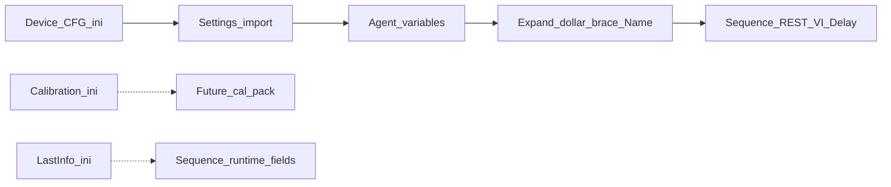

# Design: Legacy CFG layering + Device_CFG → Agent variables import

Date: 2026-08-03

## Goal

Define how old ATS `docs/CFG` INI configs map onto ATLAS Agent concepts, then ship a first import path: **pick a local `Device_CFG.ini` on the Agent 配置 page → preview address-like variables → merge into this machine’s center-stored variables**.

## Decisions (confirmed)

- Layering first; do **not** make Agent runtime depend on on-disk INI paths.
- Import UX: Agent **配置** tab, browser file picker (Approach A).
- Mapping: **fixed whitelist** of address-like keys only; variable name = `{Section}_{Key}` (Approach 1).
- Persistence: reuse existing `agent_settings.variables` (center, per `agent_id`); no new DB table for v1.
- After import preview merge into the in-memory settings editor, mark dirty; user clicks existing **保存** (or import may offer “合并并保存” that PUTs immediately — prefer **merge into editor + dirty**, one Save, to match current settings UX).

## Non-goals (v1)

- Runtime reading of INI from a fixed station directory.
- Importing `Calibration*.ini` / `LastInfo.ini` (documented in layering only).
- Importing type/enum keys (`EVB_Type`, `Comm_Type`, `DCA_Type`, …).
- Editable mapping UI / per-key rename at import time.
- Center WebUI import.
- Multi-DUT auto-merge of `DUT_1_Config` + `DUT_2_Config` in one click (user picks one file).
- Sharing variable packs across agents.

---

## Part A — Configuration layering

Old CFG mixes three concerns. ATLAS keeps them separate:

| Layer | Old examples | ATLAS home | Lifecycle |
|-------|--------------|------------|-----------|
| **Station** | `Device_CFG.ini`: `IP_Add`, `Com_Add`, `Intru_Com_Add`, `COM`, `EVB_SN`, `Port` | Agent settings **variables** (this machine) | Stable per station; change when hardware moves |
| **Calibration** | `Calibration*.ini`: offsets, `Light_Pw`, product variants | Future: versioned calibration pack / step inputs (not v1) | Changes with product / fixture |
| **Runtime** | `LastInfo.ini`: Lot, WO, TP_File | Sequence run context (SN / work order already on sequence page) | Per lot / run; not long-lived settings |

**Rule:** sequences and templates reference `${DCA_Setting_Intru_Com_Add}` (etc.), not file paths under `docs/CFG`.

---

## Part B — Device_CFG → variables import

### Whitelist keys

Only these **key names** (case-sensitive as in INI) are imported, from **any** section:

| Key | Typical meaning |
|-----|-----------------|
| `IP_Add` | EVB / device IP |
| `Com_Add` | Instrument address (IP / COM / GPIB string) |
| `Intru_Com_Add` | VISA / instrument address (DCA) |
| `COM` | Serial port name |
| `EVB_SN` | Board serial / id string |
| `Port` | TCP port (e.g. TCS) |

Empty values (`""` / whitespace-only) are **skipped** (no variable created/updated).

### Variable naming

- `name = {Section}_{Key}` after sanitizing:
  - Section and key: keep `[A-Za-z0-9_]`; replace other characters with `_`; collapse repeats; trim `_`.
  - Must match existing center validation: `^[A-Za-z_][A-Za-z0-9_]*$`, max 64 chars.
- If sanitized name is empty or invalid → skip with a warning in the preview.
- If truncated to 64 chars would collide, append a short numeric suffix in preview (rare).

Examples from sample `Device_CFG.ini`:

| INI | Variable |
|-----|----------|
| `[DCA_Setting]` `Intru_Com_Add` | `DCA_Setting_Intru_Com_Add` |
| `[EVB_Setting]` `IP_Add` | `EVB_Setting_IP_Add` |
| `[BER_Setting]` `Com_Add` | `BER_Setting_Com_Add` |
| `[TCS_Setting]` `Port` | `TCS_Setting_Port` |

### Value normalization

- Strip surrounding quotes (`"..."` / `'...'`).
- Trim whitespace.
- Do not interpret types; store as **string** (same as all agent variables).
- Tolerate minor INI quirks already present (e.g. trailing `""` on a value): strip paired quotes; leave residual junk as-is if still non-empty after strip (preview shows raw result).

### Parse rules

- Client-side parse of the selected file text (no Agent upload of CFG to center required for v1).
- Sections: `[Name]`.
- Data lines: `Key = Value` (first `=` separates key/value).
- Lines that are empty, or comments (`#`, `;`, `//`, `/*`…, or keys that are only decorative comment markers used as keys in legacy files) are ignored unless they match whitelist keys.
- Commented-out assignments (`##Com_Add = ...`) are **not** imported (line starts with `#` after trim, or key starts with `#`).

### Merge semantics

1. Parse → list of `{ name, value, description, section, key }`.
2. Description default: `从 Device_CFG [{section}] {key} 导入`.
3. For each mapped name:
   - If a variable with that **name** already exists in the editor list → **overwrite value** (and refresh description if empty or previous description was an import tag).
   - Else → **append** new variable.
4. Unrelated existing variables (Hostname, IP, manual ones) remain.
5. Mark settings dirty; user **保存** → existing `PUT /api/settings`.

Optional v1 convenience: button **导入并保存** = merge + `PUT` in one action. Prefer one primary button **预览并合并** + rely on Save; add **导入并保存** only if it stays a single clear secondary action.

### UI (配置 page)

On variables card toolbar (or below):

1. **导入 Device_CFG…** → hidden `<input type="file" accept=".ini,text/plain">`.
2. Modal or inline panel **导入预览**:
   - Table: 变量名 | 新值 | 状态（新增 / 覆盖 / 跳过）| 来源 section.key
   - Counts: added / updated / skipped.
3. Actions: **取消** / **合并到编辑区**.
4. Toast/msg on success; settings sync status → dirty until Save.

No server API change required for v1 if parse+merge is 100% in WebUI against already-loaded `/api/settings` state.

### Testing

- Unit-testable pure JS (or Rust if parser is moved server-side later): prefer a small pure function in `app.js` pattern, or extract later; for v1, `static_ui` asserts import control ids + helper name presence.
- Fixture: use a trimmed copy of `docs/CFG/DUT_1_Config/Device_CFG.ini` keys for manual check; optional tiny inline fixture string in a future unit test harness — not blocking if only static_ui + manual.

### Docs

- Short note in `docs/api.md` or settings help on 配置 page: variables may come from Device_CFG import; expand with `${Name}`.
- Keep `docs/CFG` as **reference samples**, not runtime config.

---

## Out of scope follow-ups (explicit)

1. Calibration pack import from `Calibration*.ini`.
2. Server-side INI watch / path setting.
3. DUT profile switcher (DUT1 vs DUT2 variable namespaces).

## Success criteria

- Operator can import one `Device_CFG.ini` on 配置 page and see address variables in the list.
- After Save, sequence/REST/VI fields expand `${Section_Key}` correctly via existing expand path.
- No Agent process opens files under `docs/CFG` at run time.
