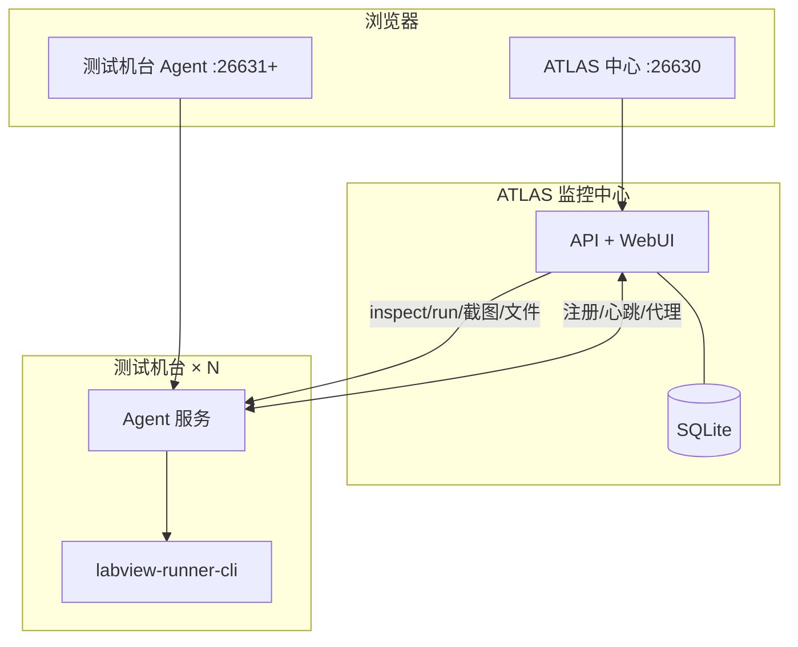
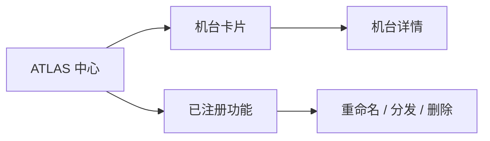
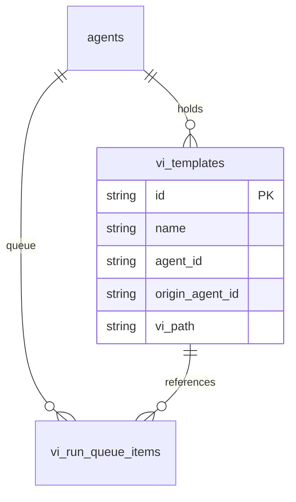
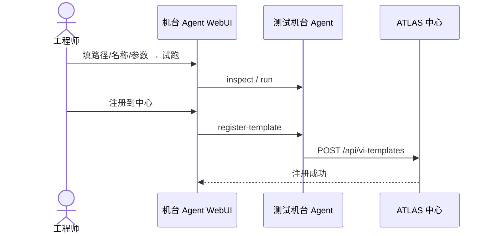
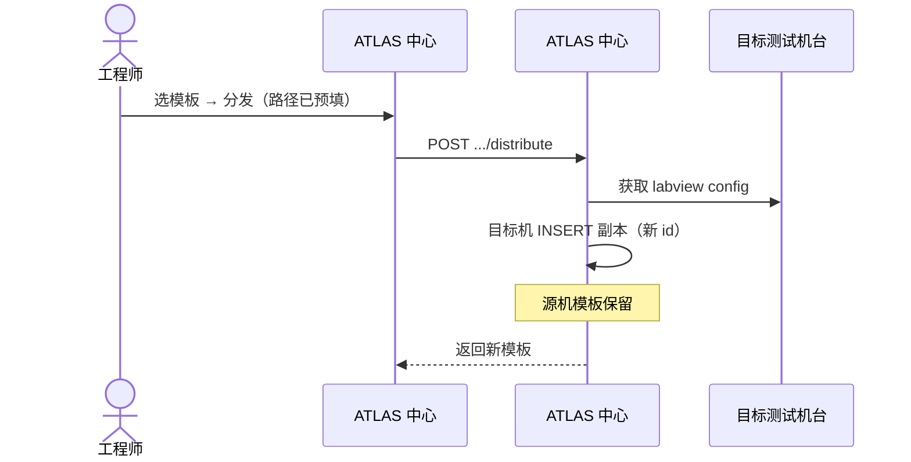
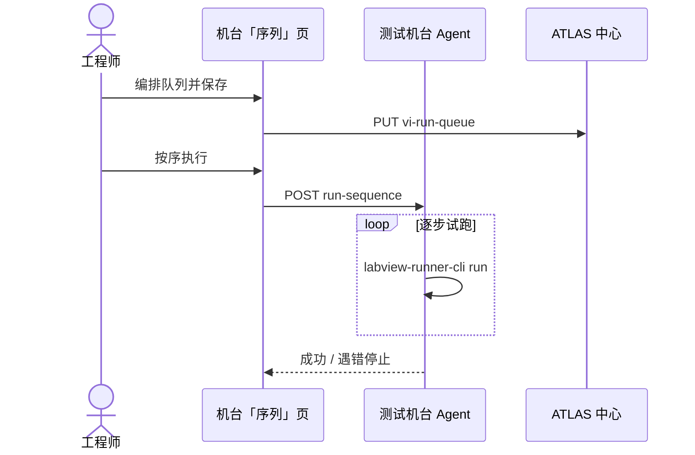
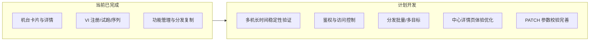

# ATLAS 分布式光模块测试系统

# 调度中心 `:26630` + 测试机台 Agent `:26631`  
**代码版本：** `master` @ `3300b7b`

---

## 一、当前进度

### 1.1 系统能力总览

| 模块       | 状态   | 说明                                       |
| -------- | ---- | ---------------------------------------- |
| 机台管理     | ✅ 可用 | ATLAS 中心卡片展示多测试机台状态；点击进入详情（截图 / 历史 / 文件） |
| VI 注册与试跑 | ✅ 可用 | 机台 Agent 端 inspect、试跑、注册（必填名称）；同路径可多实例   |
| 已注册功能管理  | ✅ 可用 | ATLAS 中心 `#/functions`：筛选、重命名、删除         |
| 跨机分发     | ✅ 可用 | 单目标复制到目标机台（新 id），源机保留；路径默认预填             |
| 执行序列     | ✅ 可用 | Agent「序列」页编排队列，按序试跑，遇错即停                 |
| 自动化测试    | ✅ 通过 | `cargo test -p scheduler -p agent`       |

### 1.2 ATLAS 中心 WebUI

| 页面    | 路由              | 功能                     |
| ----- | --------------- | ---------------------- |
| 机台    | `#/machines`    | 测试机台卡片（在线/离线、CPU、内存）   |
| 机台详情  | `#/agents/{id}` | 状态 + 截图 / 截图历史 / 文件浏览  |
| 已注册功能 | `#/functions`   | 列表、按机台筛选、重命名 / 分发 / 删除 |

### 1.3 测试机台 Agent WebUI

| 页面  | 功能                      |
| --- | ----------------------- |
| VI  | 查询参数、试跑、注册到中心、已注册列表、重命名 |
| 序列  | 双列表编排、自动保存队列、按序执行       |

### 1.4 LabVIEW VI：查询参数、试跑、注册

在 **测试机台 Agent WebUI（VI 工作台）** 完成，依赖本机 `labview-runner-cli` + LabVIEW。

| 步骤   | 操作                         | 说明                                                                      |
| ---- | -------------------------- | ----------------------------------------------------------------------- |
| 查询参数 | 填写 VI 绝对路径 → **查询参数**      | 调用 `inspect`，解析 inputs/outputs；表格中编辑各参数默认值（名称、类型只读）                     |
| 试跑   | **试跑**                     | 用当前 inputs 同步 `run`；可选前面板、超时（秒）；查看输出 JSON                               |
| 注册   | 填写 **显示名称**（必填）→ **注册到中心** | 将路径、inputs、前面板/超时及 CLI 路径快照写入 ATLAS 中心 `vi_templates`；同路径可多次注册（不同 `id`） |

注册成功后：机台端「已注册功能」可试跑、重命名；ATLAS 中心「已注册功能」可筛选、重命名、分发、删除。

---

## 二、架构设计图

### 2.1 系统部署

### 2.2 ATLAS 中心页面结构

### 2.3 核心数据关系

---

## 三、核心流程时序图

### 3.1 VI 注册

### 3.2 跨机分发（复制）

### 3.3 序列执行

---

## 四、后续计划

| 优先级 | 功能       | 说明                                   |
| --- | -------- | ------------------------------------ |
| P1  | 多机联调与稳定性 | 多台测试机长时间跑序列、分发回归                     |
| P1  | 演示与操作文档  | 标准演示流程（多机台 + 注册/分发/序列）               |
| P2  | 鉴权       | 当前无鉴权，上产线网前需内网 ACL 或登录               |
| P2  | UI 体验    | 分发成功自动关弹窗、详情页轮询不抢焦点                  |
| P3  | 分发增强     | 多目标批量复制（若业务需要）                       |
| P3  | API 校验   | PATCH 与 CREATE 对 inputs/timeout 校验对齐 |

---

## 五、结论

**ATLAS 光模块测试监控系统** 已形成 **机台监控 → VI 注册试跑 → 功能管理分发 → 序列执行** 的完整链路，具备多机台联调与演示条件。下一阶段以 **稳定性验证、产线化安全、体验打磨** 为主。